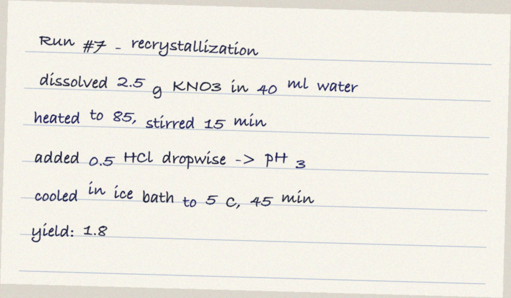
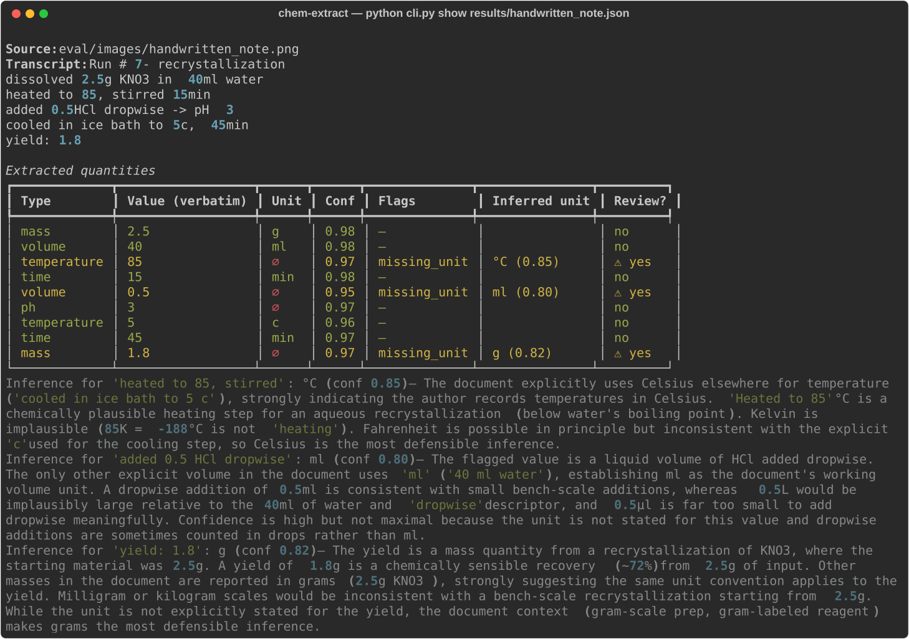
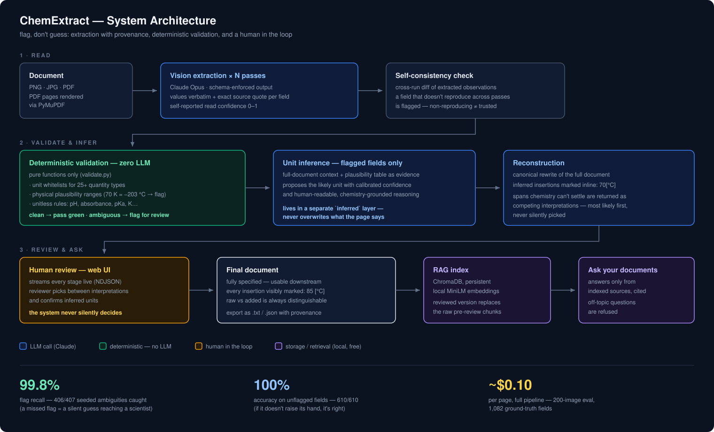

# chem-extract

**Extract structured data from chemistry documents — without ever guessing.**

A lab note says `heated to 85`. Eighty-five *what*? °C is the obvious read — but "obvious" is how
a materials scientist loses three weeks chasing a wrong number. The core design rule of this
pipeline is: **extract verbatim, validate deterministically, flag ambiguity, and keep every
inference in a separate, clearly-labeled layer that never overwrites what the document actually
says.** A confident wrong answer is the only unacceptable output.

## See it in 30 seconds — no install, no API key

**Input:** a handwritten lab note. Three quantities are missing their units — `heated to 85`,
`added 0.5 HCl`, `yield: 1.8`:



**Output** (`python cli.py show results/handwritten_note.json` — this exact result is saved in
the repo): every quantity extracted verbatim with its source quote; the three ambiguous fields
flagged for review — and for each, a *separate* inferred unit with calibrated confidence and
chemistry-grounded reasoning. Clean fields pass green; nothing is silently guessed:



Note what it did **not** do: it did not write "85 °C" into the data. The page doesn't say °C.
It says `85`, flagged `missing_unit`, with °C proposed alongside — citing the `5 c` written
elsewhere in the same note, the chemistry (aqueous recrystallization stays below 100 °C), and
why Kelvin and Fahrenheit lose (85 K = −188 °C is not "heating").

## What it does

Give it an image or PDF of a chemistry document (handwritten lab notes, typed procedures,
scanned pages). It returns structured observations like this — from a real handwritten note:

```json
{
  "quantity_type": "temperature",
  "value": "85",
  "unit": null,
  "quote": "heated to 85, stirred",
  "confidence": 0.97,
  "flags": ["missing_unit"],
  "needs_review": true,
  "inferred": {
    "unit": "°C",
    "confidence": 0.85,
    "reasoning": "The document explicitly uses Celsius elsewhere ('cooled in ice bath
      to 5 c'). 85 °C is plausible for an aqueous recrystallization (below boiling).
      Kelvin is implausible (85 K = -188 °C is not 'heating'). Fahrenheit is
      inconsistent with the explicit 'c' used for the cooling step."
  }
}
```

The raw extraction (`value`, `unit`, `quote`) is always verbatim. The unit was not on the page,
so `unit` is `null` and the field is flagged for human review. The *inference* — °C, with
calibrated confidence and a chemistry-grounded justification a reviewer can evaluate — lives in
its own sub-object. The system proposes; the human disposes.

## Architecture



- **Self-consistency:** every page is read N times; observations that don't reproduce across
  runs get `self_consistency_mismatch`.
- **Deterministic validation** (`chemextract/validate.py`): pure functions, no LLM. Unit
  whitelists and plausibility ranges for 25+ quantity types (temperature, volume, wavelength,
  molar mass, potential, …). Catches missing units, unknown units, and unit-confusion misreads
  (`70 K` as a heating temperature converts to −203 °C → `implausible_value`).
- **Grounded inference** (`chemextract/infer.py`): for flagged fields only. The LLM sees the
  full transcript *plus* a deterministic table of which candidate units are physically
  plausible. Honest "can't tell" (null unit, low confidence) beats a confident guess.
- **Hand-drawn structures** (`chemextract/structures.py`): each drawn molecule is read three
  independent ways and converged on InChIKey — a Claude *recognizer* names it, a deterministic
  `name → SMILES` resolver (local table → OPSIN → PubChem) is the trusted answer key, and DECIMER
  OCSR is an *abstain-only* cross-check. Pixel-level OCSR never decides the answer, so ruled lines
  and cartoon notation (a crown ether drawn as a dashed ring) degrade a confirmation but can't
  corrupt the result; reaction schemes and unidentified drawings are flagged, not forced.
- **Experiment + calculation checking** (`chemextract/experiment.py`): a vision LLM pass — given
  the transcript, the extracted quantities/structures, **and the page image itself** — reconstructs
  what the experiment actually was (goal, conditions, procedure, results), reading diagrams and
  reaction schemes the flattened transcript can't convey. Then **pure functions re-derive every
  calculation on the page** (`I=J·A`, `Q=I·t`, `n=Q/zF`, `m=n·M`) and flag any arithmetic that
  doesn't reproduce. The system checks the chemistry, it doesn't just transcribe it.
- **Table extraction** (`chemextract/tables.py`): a vision pass finds the genuine tables on the
  page and reads them back into structured rows and columns, cells verbatim — Page 57's electrode
  temperature log (two side-by-side `(time, temperature)` blocks plus an observations column) is
  recovered as one table instead of run-on prose. It extracts only real grids, never forcing prose
  into one, and the layout pass then drops each table where it sits on the page.
- **Special-symbol fidelity** (`chemextract/notation.py`): deterministic parsing of the notation
  that gets mangled (`1.5×10⁻⁴`, `cm⁻¹`, `cm²`, `2θ`, `°C`), and a flag when a captured value
  silently drops an exponent its source quote still shows.
- **Reconstruction** (`chemextract/reconstruct.py`): a fully-specified rewrite with inferred
  insertions marked (`70[°C]`); spans the system can't settle are returned as competing
  interpretations for a human to choose between — never silently picked.
- **Spatial layout** (`chemextract/layout.py`): a final Claude vision pass given the original
  page, a clean drawing of every recognised structure, and the reconstructed text rebuilds the
  page in 2-D — each diagram placed where it actually sits (not stacked in one column), and the
  reaction connectors the linear transcript drops (`+ e⁻`, the arrow's `−0.45 V vs Ag/AgCl`
  label, `Li +`) restored so a scheme reads left→right. Placement only: text lines stay verbatim
  and it may reference only structures the earlier legs already recognised.
- **RAG layer** (`chemextract/rag.py`): reviewed documents are indexed into ChromaDB; questions
  are answered only from indexed sources, with citations, and refused otherwise.

## Five levels of understanding

A chemistry page has to be understood at five increasing depths. Run on a real handwritten
electrochemistry page (`eval/images/page57.jpg` — Li electrodeposition in glyme electrolytes,
with hand-drawn crown-ether structures, a LiTFSI formula, and a Faraday's-law calculation):

| Level | What it means | On Page 57 |
|---|---|---|
| **1 · Text** | handwritten notes, procedures, tables read verbatim | full transcript + the 8-point time/temperature table |
| **2 · Special symbols** | notation that normally gets mangled | `°C`, `λ`, `2θ = 2.1°/4.7°`, `mA/cm²`, `1.5E-4`, `A·s` preserved; a dropped-exponent guard flags losses |
| **3 · Chemistry** | hand-drawn structures, reagents, concentrations | **diglyme, 12-crown-4, and the `[Li(12-crown-4)]⁺` complex resolved & trusted**; LiTFSI identified; the reduction *reaction* flagged, not forced into a molecule |
| **4 · Experiment** | what was actually done, and is the math right | from the transcript **and the page image**: goal/conditions/procedure/results reconstructed; the **Faraday chain re-derived and verified**: `I=J·A → 1.5e-4 A`, `Q=I·t → 0.81 C`, `n=Q/zF → 8.4e-6 mol`, `m=n·M → 5.8e-5 g`, all agree |
| **5 · Layout** | where each diagram and table sits and how the scheme reads | diglyme placed under the electrolyte line and LiTFSI/12-crown-4 by the run that draws them — not stacked in one column; the temperature **table recovered as a grid** and placed where it sits; the reduction scheme rebuilt left→right with `+ e⁻` and the arrow's `−0.45 V vs Ag/AgCl` label restored |

Why this shape: standard OCR and off-the-shelf OCSR fail on pages like this — messy handwriting,
shorthand, ruled paper, and *cartoon* structures (a metal ion floating in a dashed macrocycle) that
no pixel-to-SMILES model is trained on. The answer therefore flows through **recognition + a
deterministic answer key**, with every fragile reader demoted to a flag-or-abstain cross-check.

## One page, end to end

What the web UI does with the note above, stage by stage:

**1. Read.** Two independent vision passes produce a verbatim transcript. Observations that
don't reproduce across passes get flagged (`self_consistency_mismatch`):

> `Run #7 - recrystallization / dissolved 2.5 g KNO3 in 40 ml water / heated to 85, stirred
> 15 min / added 0.5 HCl dropwise -> pH 3 / cooled in ice bath to 5 c, 45 min / yield: 1.8`

**2. Validate.** Pure functions, no LLM: `85` has no unit → flagged. `0.5 HCl` has no unit →
flagged. `1.8` yield has no unit → flagged. `pH 3` is unitless by nature → clean. `5 c` parses
and sits in range → clean.

**3. Suggest.** For each flagged field only, a second LLM pass proposes a unit — grounded by
the deterministic plausibility table and labeled with confidence and reasoning (e.g. `85` →
°C at 0.85: *"the document writes '5 c' elsewhere; 85 K = −188 °C is not 'heating'"*).

**4. Human review.** Spans the system can't settle on chemistry grounds are presented as
competing interpretations to choose between — e.g. `yield: 1.8` → **1.8 g** (matches the
2.5 g input scale, ~72% mass recovery) vs **1.8 %** (implausibly low for a recrystallization).
The reviewer picks; the system never silently decides.

**5. Final document.** A fully-specified rewrite with every insertion visibly marked:

> `heated to 85 [°C], stirred 15 min / added 0.5 [ml] HCl dropwise → pH 3 / cooled in ice
> bath to 5 [°C], 45 min / yield: 1.8 [g]`

A last vision pass then **lays the page out in 2-D**: each recognised structure is dropped where
it actually sits rather than stacked in a column, and reaction schemes are rebuilt left→right with
the connectors the transcript dropped (`+ e⁻`, the arrow's voltage label) put back.

**6. Ask.** The finalized version is indexed (replacing the raw pre-review chunks), and the
chat panel answers questions strictly from indexed documents, with citations — *"what
temperature was the mixture heated to?"* → *"85 °C (unit inferred, human-confirmed)."*
Off-topic questions are refused.

### What that page cost

Running the full pipeline on the page above (2 vision passes + 3 unit inferences +
1 reconstruction + 1 table pass + 1 layout pass, Claude Opus 4.8 at $5/M input, $25/M output):

| | Calls | Input tok | Output tok |
|---|---|---|---|
| Vision extraction | 2 | ~3,400 | ~1,400 |
| Unit inference | 3 | ~2,000 | ~600 |
| Reconstruction | 1 | ~1,000 | ~500 |
| Tables (vision) | 1 | ~3,000 | ~700 |
| Layout (vision) | 1 | ~3,000 | ~900 |
| **Total** | **8** | **~12,400** | **~4,100** |

**≈ $0.16 per page.** Embeddings are local (sentence-transformers on CPU), so indexing is
free; each chat question costs well under a cent. A scientist's hour costs more than a
thousand of these pages.

## Evaluation

200 synthetic lab-note images (1,082 ground-truth fields) with deliberately seeded ambiguities —
missing units, unit confusion, smudged digits (`dataset/chem_notes_dataset/`):

| Metric | Result |
|---|---|
| Field detection | 1078/1082 = **99.6%** |
| Extraction accuracy (matched fields, verbatim) | **100.0%** |
| **Flag recall** (ambiguous fields correctly flagged) | 406/407 = **99.8%** |
| Unflagged accuracy (fields the system said were clean) | 610/610 = **100.0%** |

Flag recall is the #1 metric: a missed flag is a silent guess reaching a scientist.
Unflagged accuracy is the trust contract: if the system doesn't flag it, it must be right.

Reproduce with `eval/run_dataset_eval.py`. Unit tests: `python -m pytest tests/` (67 tests — the
validation, scientific-notation, structure-convergence, and calculation-checking layers are all
fully deterministic, so they run with no API calls or model downloads).

## Quickstart

```bash
python -m venv .venv && source .venv/bin/activate
pip install -r requirements.txt
pip install -r requirements-structures.txt   # hand-drawn structures (rdkit + OPSIN); needs a JRE
export ANTHROPIC_API_KEY=sk-ant-...

# CLI: process one image — all four levels in one command
python cli.py process eval/images/page57.jpg

# Just resolve a drawn reagent's structure (deterministic answer-key leg, no vision call)
python -m chemextract.structures name "12-crown-4"

# Web UI: drag-and-drop, watch every stage stream live (incl. structures + calc checks)
uvicorn webapp.server:app --port 8000   # → http://localhost:8000
```

The structure extras are optional: without `rdkit`/OPSIN the pipeline still runs and recognises
structures by name — it just can't InChIKey-confirm them, so they're flagged for review rather
than auto-trusted. The DECIMER OCSR cross-check (`pip install decimer`) is optional on top of that.

## Why this shape

Document extraction in chemistry isn't an OCR problem — it's a trust problem. The same
architecture applies anywhere an AI interprets scientific data and a human acts on the result:
mining synthesis conditions from the literature, instrument-data interpretation, lab-notebook
digitization. The handwriting case here is a stand-in; the data-integrity discipline —
verbatim + validate + calibrated confidence + flag-don't-guess — is the product.
